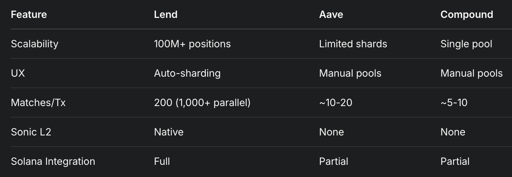

# Lend: Hyperscalable capital efficient lending protocol on Sonic SVM.

Lend is a decentralized lending protocol built on Sonic SVM, optimizing capital efficiency
and scalability for DeFi users. Designed to leverage Sonic’s HyperGrid sharding, it offers a 
scalable and robust lending solution.

## Key Features



- **Enhanced Capital Efficiency**: Continuous matching with atomic splitting ensures funds are utilized effectively, pairing large positions with smaller counterparts seamlessly.
- **User Convenience**: Stale positions are refunded automatically (99.5%), with a 0.5% fee to deter spam—no manual claims required.
- **Risk Management**: Loans require 1.5x collateral minimum, with liquidation at 1.2x, ensuring stability without oracles.
- **Shard Isolation**: Sharding enhancing performance, scalability and security across the protocol.
- **Sonic Integration**: Built for Sonic SVM’s low-cost storage and parallel execution, delivering high performance at scale.

## How It Works

1. Borrowers offer asks with collateral and rate caps. 
2. Lenders submit bids with loan amounts, rates, and durations.
3. Real-time matching pairs bids and asks atomically.
4. Loans accrue interest; repay or face liquidation if health drops below 1.2x.
5. Admin withdraws fees from shard-specific treasuries.

## Lend/Sonic Advantage

Lend taps into Sonic SVM’s sharding and efficiency to deliver a lending protocol that’s secure, 
scalable, and capital-efficient—ready for the future of DeFi.

## Steps to Test Lend Contract

Install the Following:
- Anchor (v0.29.0)
- Solana CLI (v1.18.26)
- NPM (v11.1.0)
- Node (v23.6.0)

### Build the Contract:

```bash
    anchor build
```

### Run Test

- Run Local Solana Validator:

```bash
    solana-test-validator -r
```

- Uncomment the test you want to test in `contract/tests/contract.ts` and Run Tests in another terminal:

```bash
    anchor test --skip-local-validator
```

## Steps to Test Lend Frontend (Prototype)

- Visit `https://sonic-lend.vercel.app`

---

**Deploy**: `anchor deploy --provider.cluster https://testnet.sonic.game`  
**Contribute**: Open an issue or PR.
